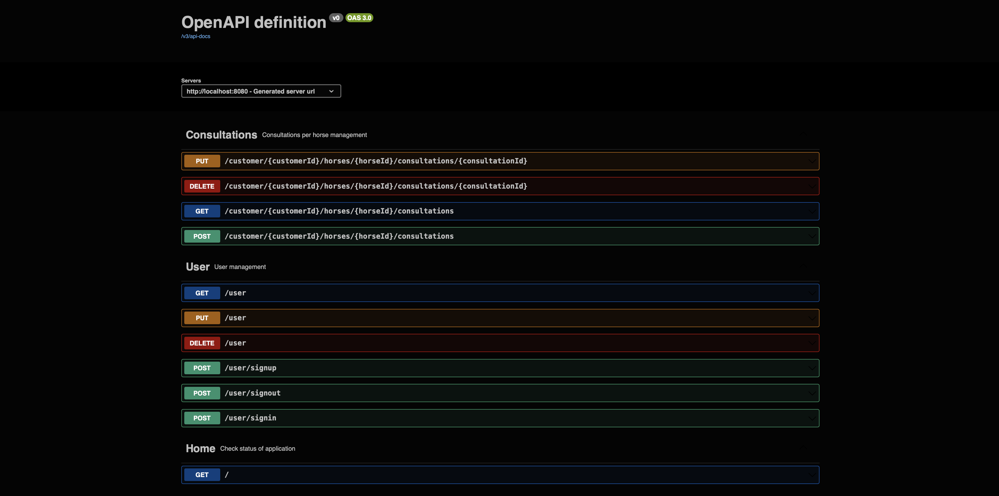
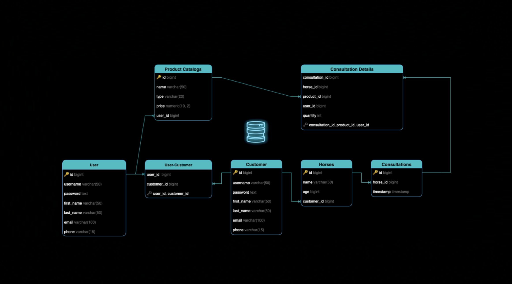

# [HorseApp - Equine Management](https://github.com/joseag312/portfolio-spring-app)

🐎 **A full-featured CRUD application for veterinarians and horse owners, built with Spring Boot**

A full-featured CRUD web application that streamlines equine care and client management.  
Built with Spring Boot, Spring Security, PostgreSQL, and Swagger.

Veterinarians can:

- Manage clients and their horses
- Browse each horse’s treatment history
- List products and services
- Handle client billing

Users can:

- Assign a veterinarian to their horses
- Browse consultation history
- Transfer horses (along with their full medical history) to another user

**Designed as a portfolio piece to showcase software engineering best practices.**

---

## Portfolio Focus

This project was designed as a **demonstration of software engineering practices** applied to back-end development.

### SOLID

- **Single Responsibility Principle**: Controllers, services, and repositories handle only one layer of responsibility.
- **Open/Closed Principle**: New endpoints and entities can be added without modifying existing logic.
- **Liskov Substitution Principle**: DTOs and entities can be swapped in the service logic if they follow the same contract.
- **Interface Segregation Principle**: Repository interfaces expose only the necessary persistence operations.
- **Dependency Inversion Principle**: Controllers depend on service abstractions, not repositories.

### Security & Authorization

- **Spring Security Integration**: Configuration in two classes `SecurityConfig` and `MethodSecurityConfig`.
- **Role-Based Access Control**: Fine-grained access based on roles done with `@PreAuthorize` and an `AccessGuard`.
- **Authentication Flow**: Implemented `AuthenticationService` and `AuthorizationService`.

### Data Persistence

- **Normalized PostgreSQL** Schemas with sequences for unique IDs.
- **Strong constraints**: Unique keys, composite PKs, and cascading FKs for integrity.
- **Targeted indexing** Lookup & join columns indexed for performance.
- **Clear naming conventions** Scripts design for repeatable setups and DB recreation.

### Spring Framework

- **Layered Architecture**: Controllers → Services → Repositories.
- **Data JPA**: Repositories abstract persistence.
- **Spring Security**: Centralized configuration and role-based access via `@PreAuthorize`.
- **Dependency Injection**: Services and components wired through Spring’s IoC container.
- **DTO Mapping**: Request/response models decouple API contracts from entities.

### API Documentation

- **Interactive API Docs**: Integrated Swagger/OpenAPI UI.
- **Auto-Generated Contracts**: Controllers annotated for proper documentation.
- **Developer Experience**: Demonstrates API-first design for other developers.

---

## Features

- **User Management:**

  - Signup & login
  - Role selection (**Veterinarian, Customer**)
  - Session handling to prevent frequent logins

- **Veterinarian Features:**

  - Accept new customers & their horses
  - Manage treatment & medication records with pricing
  - Conduct consultations including treatments & prescribed medications

- **Customer Features:**

  - Request vet acceptance for themselves and their horses
  - Retrieve itemized invoices for consultations

- **API & Documentation**

  - API exploration via \*\*Swagger/OpenAPI
  - Auto-generated contracts from annotated controllers

- **Data Layer**
  - Normalized DB schemas with cascades, composite keys and indexting
  - Entities mapped with **Spring Data JPA**

---

## Tech Stack

- **Framework**: Spring Boot (Java)
- **Security**: Spring Security with JWT & role-based access control
- **Persistence**: Spring Data JPA with PostgreSQL
- **API Docs**: Swagger / OpenAPI
- **Build Tool**: Maven

---

## Get Started

- Clone the repository
- Set up PostgreSQL and run the provided Schema script in: `/src/main/resources/SQL`
- Configure application properties for PostgreSQL credentials
- Build & run the app

---

## Screenshots

### 🧩 Testing

### 📓 Swagger

### ⚙️ Database

---
